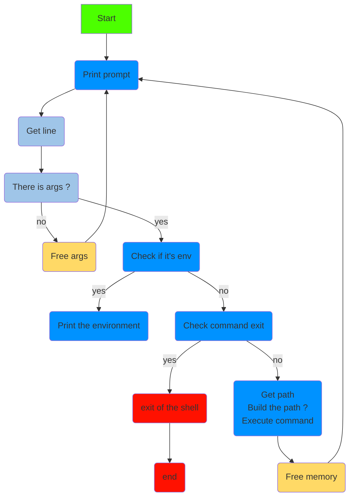

# Project Simple Shell


## Summary
- [Description](#description)
- [Flowchart](#Flowchart)
- [Output](#Output)
- [Compilation](#Compilation)
- [Authors](#Authors)

### Description

Simple Shell is a lightweight UNIX command-line interpreter. It replicates a basic shell environment, supporting fundamental commands and utilities to provide a deeper understanding of how a shell operates internally.

### Flowchart



---
### Output examples

```bash
root@Hamza:~/holbertonschool-simple_shell# ./hsh
$ ls
AUTHORS  README.md  _Free_args.c  _execute.c  _path.c  _printenv.c  _strtok.c  exercice_test  hsh  main.h  man_1_simple_shell  shell.c
$ /bin/ls
AUTHORS  README.md  _Free_args.c  _execute.c  _path.c  _printenv.c  _strtok.c  exercice_test  hsh  main.h  man_1_simple_shell  shell.c
$ exit
root@Hamza:~/holbertonschool-simple_shell#
```

---
### Compilation

for compile and execute the code, enter this line


```bash
gcc -Wall -Werror -Wextra -pedantic -std=gnu89 *.c -o hsh
```

---

# [main.h](https://github.com/KillianRipoche/holbertonschool-simple_shell/blob/main/main.h)

```c
#ifndef SHELL_H
#define SHELL_H

#include <stdio.h>
#include <stdlib.h>
#include <string.h>
#include <unistd.h>
#include <sys/types.h>
#include <sys/wait.h>
#include <sys/stat.h>

#define MAX_TOKENS 64

void print_env(char **env);
char *build_full_path(char *dir, char *command);
char *find_path_in_env(char **env);
char **tokenize_input(char *input);
void free_args(char **args);
char *get_command_path(char *command, char **env);
void execute_command(char *command, char **env);

#endif
```

---

### Authors

- [Killian Ripoche](https://github.com/KillianRipoche)
- [Hamza Moinet](https://www.github.com/HamzaMoinet)
